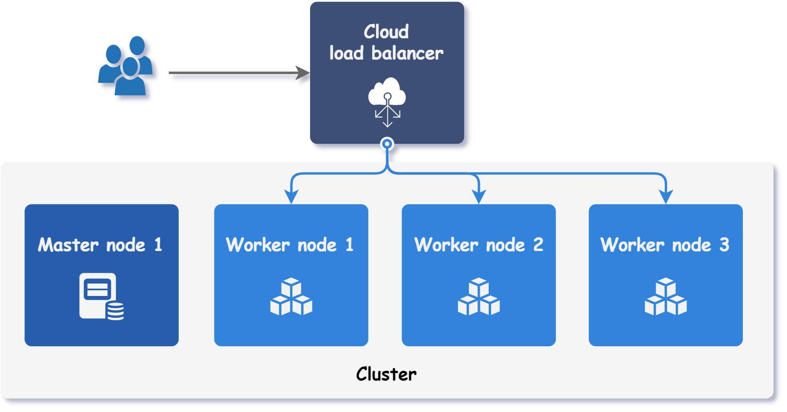
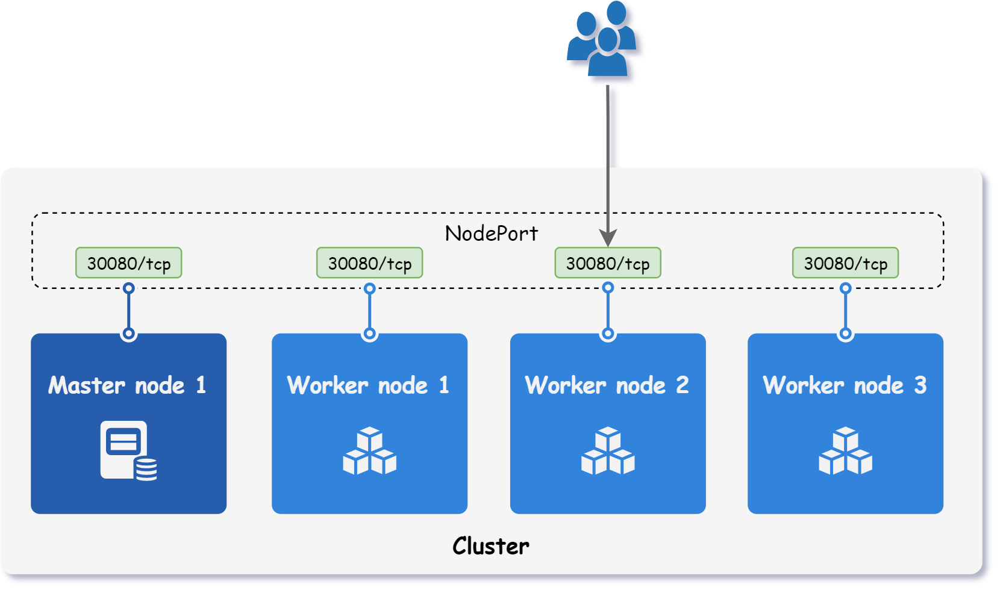
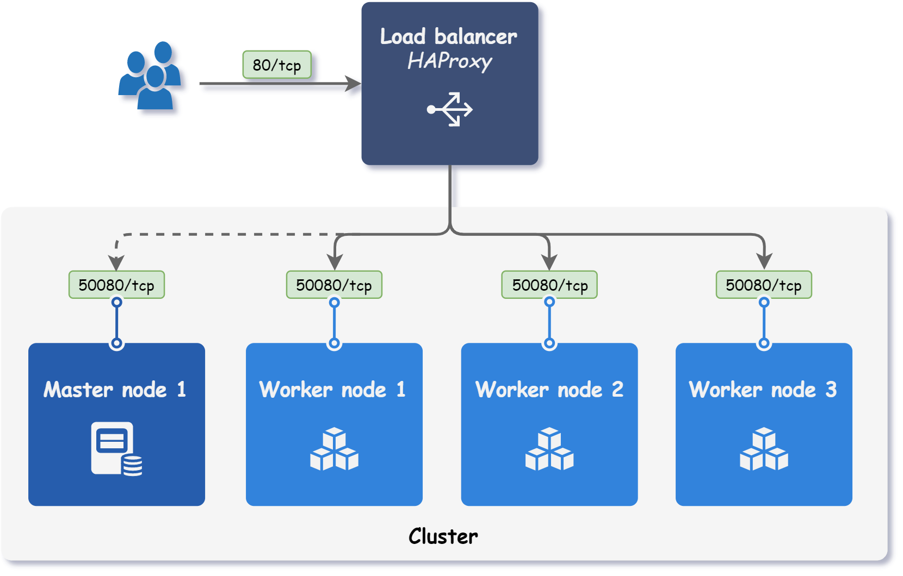

<div markdown="1" class="text-center">
# Accessing the cluster
</div>

<div markdown="1" class="text-justify">

Cloud providers that support Kubernetes clusters typically provide load balancer provisioning on demand. 
By setting a Service type to `LoadBalancer`, an external load balancer is automatically provisioned with its own unique IP address.
This load balancer redirects all incoming connections to the Service, as illustrated in the figure below.

<div class="text-center">
  
</div>

In on-premise environments, there is no load balancer that can be provisioned on demand.
Therefore, some alternative solutions are explained in this document.

## Node ports

Setting Service type to `NodePort` makes Kubernetes reserve a port on all its nodes.
As a result, the Service becomes available on `<NodeIP>:<NodePort>`, as shown in the figure below.

<div class="text-center">
  
</div>

When using `NodePort`, it does not matter to which node a client sends the request, since it is routed internally to the appropriate Pod.
However, if all traffic is directed to a single node, its failure will make the Service unavailable.

## Self-provisioned edge

With Kubitect, it is possible to configure the port forwarding of the load balancer to distribute incoming requests to multiple nodes in the cluster, as shown in the figure below.

<div class="text-center">
  
</div>

To set up load balancer port forwarding, at least one load balancer must be configured.
The following example shows how to set up load balancer port forwarding for ports 80 (HTTP) and 443 (HTTPS).

```yaml
cluster:
  nodes:
    loadBalancer:
      forwardPorts:
        - name: http
          port: 80
        - name: https
          port: 443          
      instances:
        - id: 1
```

Load balancer port forwarding is particularly handy when combined with a `NodePort` Service or a Service whose ports are exposed on the host.
For example, for HTTP and HTTPS traffic an Ingress is most often used.
To use Ingress resources in the Kubernetes cluster, an [ingress controller](https://kubernetes.io/docs/concepts/services-networking/ingress-controllers/) is required.
With Kubitect, a load balancer can be configured to accept connections on ports 80 and 443, and redirect them to all cluster nodes on ports 50080 and 50443 where an ingress controller is listening for incoming requests.
The following code snippet shows the configuration for such a scenario.

```yaml
cluster:
  nodes:
    loadBalancer:
      forwardPorts:
        - name: http
          port: 80
          targetPort: 50080
          target: workers # (1)!
        - name: https
          port: 443
          targetPort: 50443
      instances:
        - id: 1

addons:
  kubespray:
    ingress_nginx_enabled: true
    ingress_nginx_namespace: "ingress-nginx"
    ingress_nginx_insecure_port: 50080 # (2)!
    ingress_nginx_secure_port: 50443
```

1.  By default, each configured port instructs the load balancer to distribute traffic across all worker nodes.
    The default behavior can be changed using the `target` property.

    Possible target values are:

      + `workers` - Distributes traffic across worker nodes. *(default)*
      + `masters` - Distributes traffic across master nodes.
      + `all` - Distributes traffic across master and worker nodes.

2.  When the ingress-nginx controller is set up with Kubespray, a DaemonSet is created that exposes ports on the host (`hostPort`).

## MetalLB

[MetalLB](https://metallb.io) is a network load balancer implementation for bare metal Kubernetes clusters.
In short, it allows you to create Services of type `LoadBalancer` where actual on-demand load balancers are not an option.

For MetalLB to work, a pool of unused IP addresses needs to be provided.
In the following example, MetalLB is configured to use an IP address pool with the IP range `10.10.13.225/27`.

```yaml
addons:
  kubespray:
    metallb_enabled: true
    metallb_speaker_enabled: true
    metallb_ip_range:
      - "10.10.13.225/27"
    metallb_pool_name: "default"
    metallb_auto_assign: true
    metallb_version: v0.12.1
    metallb_protocol: "layer2"
```

When a Service of type `LoadBalancer` is created, it is assigned an IP address from the pool.
For example, we could deploy an ingress-nginx controller and change its Service type to `LoadBalancer`.
```sh
# Deploy ingress-nginx controller
kubectl apply -f https://raw.githubusercontent.com/kubernetes/ingress-nginx/main/deploy/static/provider/baremetal/1.23/deploy.yaml

# Patch ingress controller Service type to LoadBalancer
kubectl patch svc ingress-nginx-controller -n ingress-nginx -p '{"spec": {"type":"LoadBalancer"}}'
```

As a result, MetalLB assigns the service `ingress-nginx-controller` an external IP address from the address pool.
```sh
kubectl get svc -n ingress-nginx ingress-nginx-controller

# NAME                       TYPE           CLUSTER-IP      EXTERNAL-IP    PORT(S)                      AGE
# ingress-nginx-controller   LoadBalancer   10.233.55.194   10.10.13.225   80:31497/TCP,443:30967/TCP   63s
```

By sending a request to the assigned IP address, it can be seen that Nginx responds to the request.
```sh
curl -k https://10.10.13.225

# <html>
# <head><title>404 Not Found</title></head>
# <body>
# <center><h1>404 Not Found</h1></center>
# <hr><center>nginx</center>
# </body>
# </html>
```

This example has demonstrated the functionality of MetalLB in `layer2` mode.
For more MetalLB configuration options, see the [official MetalLB documentation](https://metallb.io).

</div>
