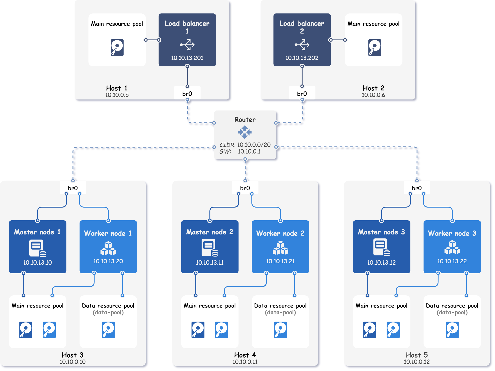
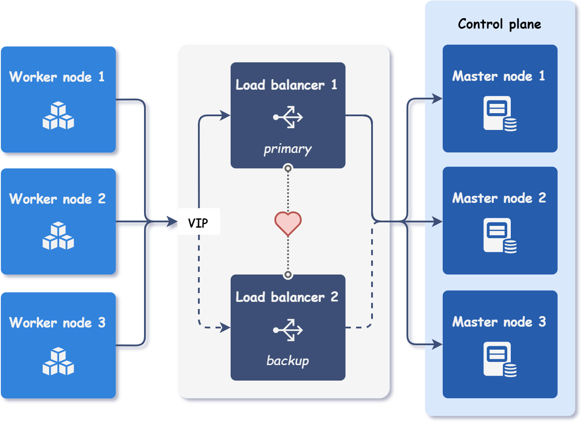

<div markdown="1" class="text-center">
# Highly available cluster
</div>

<div markdown="1" class="text-justify">

This example demonstrates how to use Kubitect to create a highly available Kubernetes cluster that spans across five hosts.
This topology offers redundancy in case of node or host failures.

The final topology of the deployed Kubernetes cluster is shown in the figure below.

<div text="text-center">
  
</div>

## Step 1: Hosts configuration

This example involves the deployment of a Kubernetes cluster on five remote physical hosts.
The local network subnet used in this setup is `10.10.0.0/20`, with the gateway IP address set to `10.10.0.1`.
All hosts are connected to the same local network and feature a pre-configured bridge interface, named `br0`.

!!! tip "Tip"

    This example uses **preconfigured bridges on each host** to expose nodes on the local network.

    [Network bridge](../network-bridge) example shows how to configure a bridge interface using Netplan.

Furthermore, we have configured a user named `kubitect` on each host, which can be accessed through SSH using the same certificate stored on our local machine without the need for a password. The certificate is located at `~/.ssh/id_rsa_ha`.

To deploy the Kubernetes cluster, each host's details must be specified in the Kubitect configuration file.
In this case, the host configurations differ only in the host's name and IP address.

```yaml title="ha.yaml"
hosts:
  - name: host1
    connection:
      type: remote
      user: kubitect
      ip: 10.10.0.5
      ssh:
        keyfile: "~/.ssh/id_rsa_ha"
  - name: host2
    connection:
      type: remote
      user: kubitect
      ip: 10.10.0.6
      ssh:
        keyfile: "~/.ssh/id_rsa_ha"
  - name: host3
    connection:
      type: remote
      user: kubitect
      ip: 10.10.0.10
      ssh:
        keyfile: "~/.ssh/id_rsa_ha"
  - name: host4
    connection:
      type: remote
      user: kubitect
      ip: 10.10.0.11
      ssh:
        keyfile: "~/.ssh/id_rsa_ha"
  - name: host5
    connection:
      type: remote
      user: kubitect
      ip: 10.10.0.12
      ssh:
        keyfile: "~/.ssh/id_rsa_ha"
```

## Step 2: Network configuration

In the network configuration section, we specify the bridge interface that is preconfigured on each host and CIDR of our local network.

The code snippet below illustrates the network configuration used in this example:

```yaml title="ha.yaml"
cluster:
  network:
    mode: bridge
    cidr: 10.10.0.0/20
    bridge: br0
```

## Step 3: Load balancer configuration

By placing a load balancer in front of the control plane (as shown in the [Multi-master cluster](../multi-master-cluster) example), traffic can be distributed across all control plane nodes.

Placing a load balancer in front of the control plane, as demonstrated in the [Multi-master cluster example](../multi-master-cluster), enables traffic distribution across all healthy control plane nodes.
However, having only one load balancer in the cluster would create a single point of failure, potentially rendering the control plane inaccessible if the load balancer fails.

To prevent this scenario, it is necessary to configure at least two load balancers.
One of the load balancers serves as the primary, while the other functions as a failover (backup).
The purpose of the failover load balancer is to serve incoming requests using the same virtual (shared) IP address if the primary load balancer fails, as depicted in the figure below.

<div class="text-center">
  
</div>

To achieve failover, a virtual router redundancy protocol (VRRP) is used.
In practice, each load balancer has its own IP address, but the primary load balancer also serves requests on the virtual IP address, which is not bound to any network interface.

The primary load balancer sends periodic heartbeats to the backup load balancers to indicate that it is still active.
If the backup load balancer does not receive a heartbeat within a specified time period, it assumes that the primary load balancer has failed.
The new primary load balancer is then elected based on the available load balancers' priorities.
Once the new primary load balancer is selected, it starts serving requests on the same virtual IP address as the previous primary load balancer.

The following code snippet shows the configuration of two load balancers and virtual IP for their failover.
The load balancers are also configured to be deployed on different hosts for additional redundancy.

```yaml title="ha.yaml"
cluster:
  nodes:
    loadBalancer:
      vip: 10.10.13.200
      instances:
        - id: 1
          ip: 10.10.13.201
          host: host1
        - id: 2
          ip: 10.10.13.202
          host: host2
```

## Step 4: Nodes configuration

The configuration of the nodes is straightforward and similar to the load balancer instance configuration.
Each node instance is configured with an ID, an IP address, and a host affinity.

```yaml title="ha.yaml"
cluster:
  nodes:
    master:
      instances:
        - id: 1
          ip: 10.10.13.10
          host: host3
        - id: 2
          ip: 10.10.13.11
          host: host4
        - id: 3
          ip: 10.10.13.12
          host: host5
    worker:
      instances:
        - id: 1
          ip: 10.10.13.20
          host: host3
        - id: 2
          ip: 10.10.13.21
          host: host4
        - id: 3
          ip: 10.10.13.22
          host: host5
```

### Step 4.1 (Optional): Data disks configuration

Kubitect automatically creates a main (system) disk for each configured node.
Main disk contains the operating system and installed Kubernetes components.

Additional disks, also known as data disks, can be created to expand the node's storage capacity.
This feature is particularly useful when using storage solutions like Rook, which can utilize empty disks to provide reliable distributed storage.

Data disks in Kubitect must be configured separately for each node instance.
They must also be connected to a resource pool, which can be either a main resource pool or a custom data resource pool.
In this example, we have defined a custom data resource pool named `data-pool` on each host running worker nodes.

Configuring data disks in Kubitect requires a separate configuration for each node instance, with each disk connected to a resource pool.
The resource pool can be either a main resource pool or a custom data resource pool.
In this example, we have defined a custom data resource pool named `data-pool` on each host that runs worker nodes.

```yaml title="ha.yaml"
hosts:
  - name: host3
    ...
    dataResourcePools:
      - name: data-pool
        path: /mnt/libvirt/pools/

cluster:
  nodes:
    worker:
      - id: 1
        ...
        host: host3
        dataDisks:
          - name: rook
            pool: data-pool
            size: 512 # GiB
```


??? abstract "Final cluster configuration <i class="click-tip"></i>"

    ```yaml title="ha.yaml"
    hosts:
      - name: host1
        connection:
          type: remote
          user: kubitect
          ip: 10.10.0.5
          ssh:
            keyfile: "~/.ssh/id_rsa_ha"
      - name: host2
        connection:
          type: remote
          user: kubitect
          ip: 10.10.0.6
          ssh:
            keyfile: "~/.ssh/id_rsa_ha"
      - name: host3
        connection:
          type: remote
          user: kubitect
          ip: 10.10.0.10
          ssh:
            keyfile: "~/.ssh/id_rsa_ha"
        dataResourcePools:
          - name: data-pool
            path: /mnt/libvirt/pools/
      - name: host4
        connection:
          type: remote
          user: kubitect
          ip: 10.10.0.11
          ssh:
            keyfile: "~/.ssh/id_rsa_ha"
        dataResourcePools:
          - name: data-pool
            path: /mnt/libvirt/pools/
      - name: host5
        connection:
          type: remote
          user: kubitect
          ip: 10.10.0.12
          ssh:
            keyfile: "~/.ssh/id_rsa_ha"
        dataResourcePools:
          - name: data-pool
            path: /mnt/libvirt/pools/

    cluster:
      name: kubitect-ha
      network:
        mode: bridge
        cidr: 10.10.0.0/20
        bridge: br0
      nodeTemplate:
        user: k8s
        updateOnBoot: true
        ssh:
          addToKnownHosts: true
        os:
          distro: ubuntu22
      nodes:
        loadBalancer:
          vip: 10.10.13.200
          instances:
            - id: 1
              ip: 10.10.13.201
              host: host1
            - id: 2
              ip: 10.10.13.202
              host: host2
        master:
          instances:
            - id: 1
              ip: 10.10.13.10
              host: host3
            - id: 2
              ip: 10.10.13.11
              host: host4
            - id: 3
              ip: 10.10.13.12
              host: host5
        worker:
          instances:
            - id: 1
              ip: 10.10.13.20
              host: host3
              dataDisks:
                - name: rook
                  pool: data-pool
                  size: 512
            - id: 2
              ip: 10.10.13.21
              host: host4
              dataDisks:
                - name: rook
                  pool: data-pool
                  size: 512
            - id: 3
              ip: 10.10.13.22
              host: host5
              dataDisks:
                - name: rook
                  pool: data-pool
                  size: 512

    kubernetes:
      version: v1.27.5
    ```

## Step 5: Applying the configuration

To deploy a cluster, apply the configuration file:

```sh
kubitect apply --config ha.yaml
```

</div>
