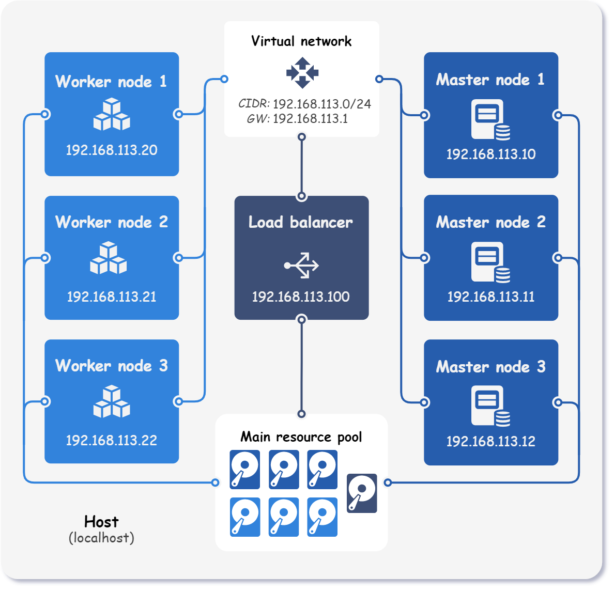
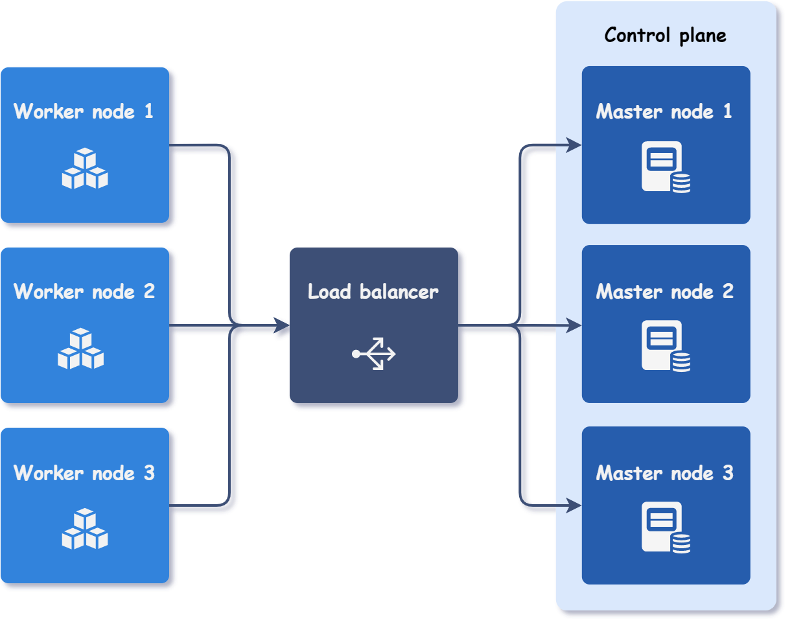

<div markdown="1" class="text-center">
# Multi-master cluster
</div>

<div markdown="1" class="text-justify">

This example demonstrates how to use Kubitect to set up a Kubernetes cluster with **3 master and 3 worker nodes**.

By configuring multiple master nodes, the control plane remains to operate normally even if some master nodes fail.
Since Kubitect deploys clusters with a stacked control plane, the redundancy is ensured as long as there are at least (n/2)+1 master nodes available.

The final topology of the deployed Kubernetes cluster is depicted in the figure below.

<div class="text-center">
  
</div>

!!! note "Note"

    This example skips the explanation of some common configurations such as hosts, network, and node template, as they are already covered in detail in the [Getting started (step-by-step)](../../getting-started/getting-started) guide.

!!! preset "Preset available"

    To export the preset configuration, run:
    <code>
      kubitect export preset <b>example-multi-master</b>
    </code>

## Step 1: Cluster configuration

When deploying a multiple master Kubernetes cluster using Kubitect, it is necessary to configure at least one load balancer.
The load balancer is responsible for distributing traffic evenly across the control plane nodes.
In the event of a particular master node failure, the load balancer automatically detects the unhealthy node and routes traffic only to the remaining healthy nodes, ensuring the continuous availability of the Kubernetes cluster.

The figure below provides a visual representation of this approach.

<div class="text-center">
  
</div>

To create such a cluster, all we need to do is specify the desired node instances and configure one load balancer.
The control plane will be accessible through the load balancer's IP address.

```yaml title="multi-master.yaml"
cluster:
  ...
  nodes:
    loadBalancer:
      instances:
        - id: 1
          ip: 192.168.113.100
    master:
      instances: # (1)!
        - id: 1
          ip: 192.168.113.10
        - id: 2
          ip: 192.168.113.11
        - id: 3
          ip: 192.168.113.12
    worker:
      instances:
        - id: 1
          ip: 192.168.113.20
        - id: 2
          ip: 192.168.113.21
        - id: 3
          ip: 192.168.113.22
```

1. Size of the control plane (number of master nodes) must be odd.

Kubitect automatically detects the load balancer instance in the configuration file and installs the *HAProxy* load balancer on an additional virtual machine.
The load balancer is then configured to distribute traffic received on port 6443, which is the Kubernetes API server port, to all control plane nodes.

??? abstract "Final cluster configuration <i class="click-tip"></i>"

    ```yaml title="multi-master.yaml"
    hosts:
      - name: localhost
        connection:
          type: local

    cluster:
      name: k8s-cluster
      network:
        mode: nat
        cidr: 192.168.113.0/24
      nodeTemplate:
        user: k8s
        updateOnBoot: true
        ssh:
          addToKnownHosts: true
        os:
          distro: ubuntu
      nodes:
        loadBalancer:
          instances:
            - id: 1
              ip: 192.168.113.100
        master:
          instances:
            - id: 1
              ip: 192.168.113.10
            - id: 2
              ip: 192.168.113.11
            - id: 3
              ip: 192.168.113.12
        worker:
          instances:
            - id: 1
              ip: 192.168.113.20
            - id: 2
              ip: 192.168.113.21
            - id: 3
              ip: 192.168.113.22

    kubernetes:
      version: v1.24.7
      networkPlugin: calico
    ```

## Step 2: Applying the configuration

To deploy a cluster, apply the configuration file:

```sh
kubitect apply --config multi-master.yaml
```

</div>
