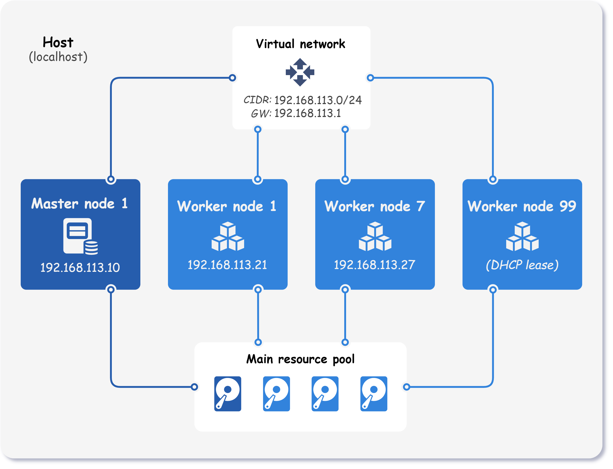

<div markdown="1" class="text-center">
# Multi-worker cluster
</div>

<div markdown="1" class="text-justify">

This example shows how to use Kubitect to set up a Kubernetes cluster with **one master and three worker nodes**.

<div class="text-center">
  
</div>

!!! note "Note"

    In this example we skip the explanation of some common configurations (hosts, network, node template, ...), as they are already explained in the [Getting started (step-by-step)](../../getting-started/getting-started) guide.

## Step 1: Cluster configuration

To create a cluster with multiple workers, simply specify multiple worker nodes in the configuration.
In this particular case, we want to have 3 worker nodes, but there can be as many as you want.

```yaml title="multi-worker.yaml" 
cluster:
  ...
  nodes:
    master:
      instances:
        - id: 1
          ip: 192.168.113.10 # (1)!
    worker:
      instances:
        - id: 1
          ip: 192.168.113.21
        - id: 7
          ip: 192.168.113.27
        - id: 99
```

1.  Static IP address of the node. 
    If the `ip` property is omitted, the DHCP lease is requested when the cluster is created.

??? abstract "Final cluster configuration <i class="click-tip"></i>"

    ```yaml title="multi-worker.yaml" 
    hosts:
      - name: localhost
        connection:
          type: local

    cluster:
      name: local-k8s-cluster
      network:
        mode: nat
        cidr: 192.168.113.0/24
      nodeTemplate:
        user: k8s
        updateOnBoot: true
        ssh:
          addToKnownHosts: true
        os:
          distro: ubuntu
      nodes:
        master:
          instances:
            - id: 1
              ip: 192.168.113.10
        worker:
          instances:
            - id: 1
              ip: 192.168.113.21
            - id: 7
              ip: 192.168.113.27
            - id: 99

    kubernetes:
      version: v1.23.7
      networkPlugin: calico
      dnsMode: coredns
      kubespray:
        version: v2.20.0
    ```

## Step 2: Applying the configuration

Apply the cluster:
```sh
kubitect apply --config multi-worker.yaml
```

</div>
