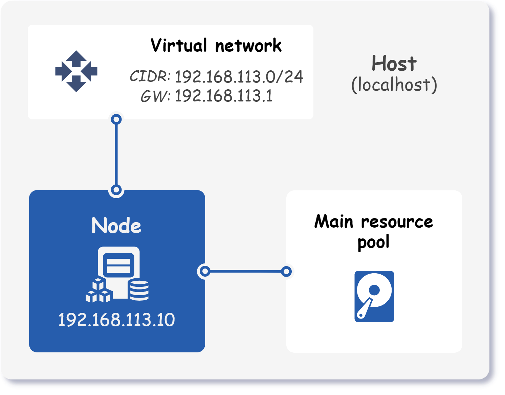

<div markdown="1" class="text-center">
# Single node cluster
</div>

<div markdown="1" class="text-justify">

This example demonstrates how to set up a single-node Kubernetes cluster using Kubitect.
In a single-node cluster, only one master node needs to be configured.
The topology of the Kubernetes cluster deployed in this guide is shown below.

<div class="text-center">
  
</div>

!!! note "Note"

    This example skips the explanation of some common configurations such as hosts, network, and node template, as they are already covered in detail in the [Getting started (step-by-step)](../../getting-started/getting-started) guide.

!!! preset "Preset available"

    To export the preset configuration, run:
    <code>
      kubitect export preset <b>example-single-node</b>
    </code>

## Step 1: Create the configuration

To initialize a single-node Kubernetes cluster, you need to specify a single master node in the cluster configuration file.

```yaml title="single-node.yaml"
cluster:
  ...
  nodes:
    master:
      instances:
        - id: 1
          ip: 192.168.113.10 # (1)!
```

1.  Static IP address of the node.
    If the `ip` property is omitted, the DHCP lease is requested when the cluster is created.

When no worker nodes are specified, master nodes are labeled as schedulable, which makes them behave as both master and worker nodes.
This means that the single master node in the cluster will perform both the control plane functions of a Kubernetes master node and the data plane functions of a worker node.

??? abstract "Final cluster configuration <i class="click-tip"></i>"

    ```yaml title="single-node.yaml"
    hosts:
      - name: localhost
        connection:
          type: local

    cluster:
      name: k8s-cluster
      network:
        mode: nat
        cidr: 192.168.113.0/24
      nodeTemplate:
        user: k8s
        updateOnBoot: true
        ssh:
          addToKnownHosts: true
        os:
          distro: ubuntu22
      nodes:
        master:
          default:
            ram: 4
            cpu: 2
            mainDiskSize: 32
          instances:
            - id: 1
              ip: 192.168.113.10

    kubernetes:
      version: v1.27.5
      networkPlugin: calico
    ```

## Step 2: Applying the configuration

To deploy a cluster, apply the configuration file:

```sh
kubitect apply --config single-node.yaml
```

</div>
