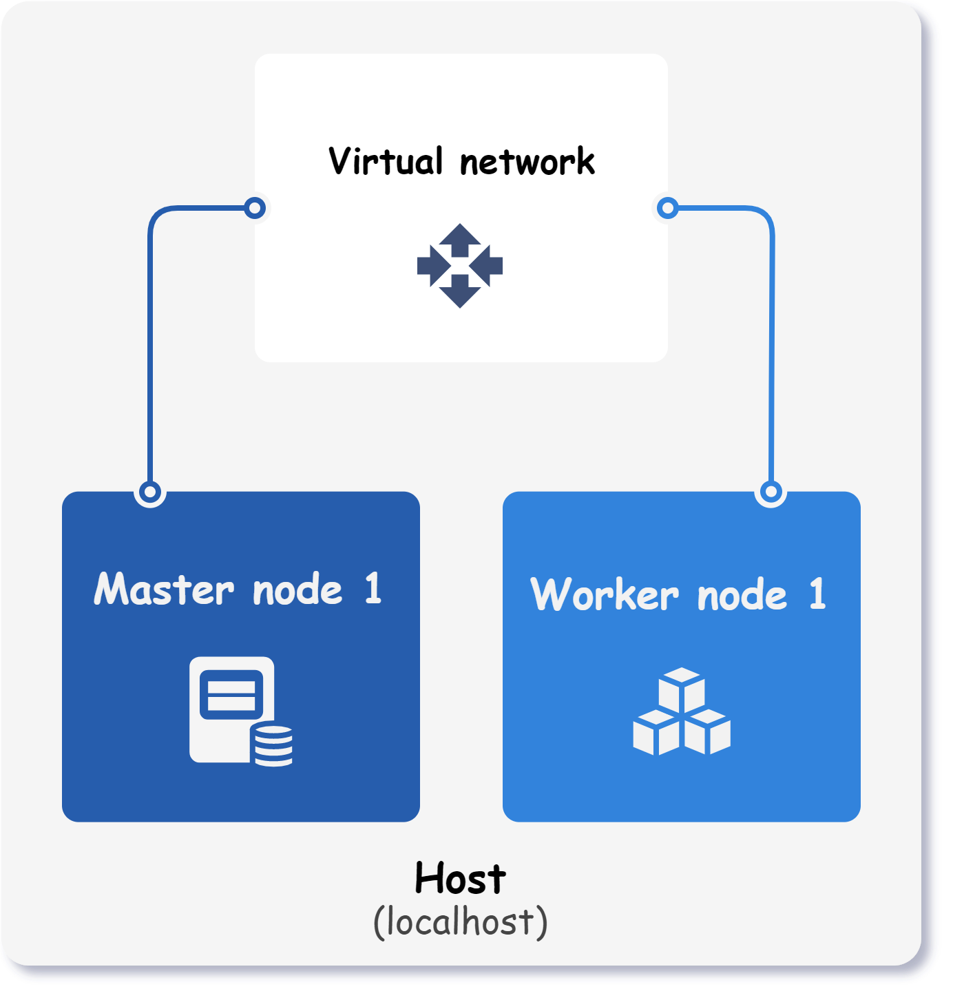
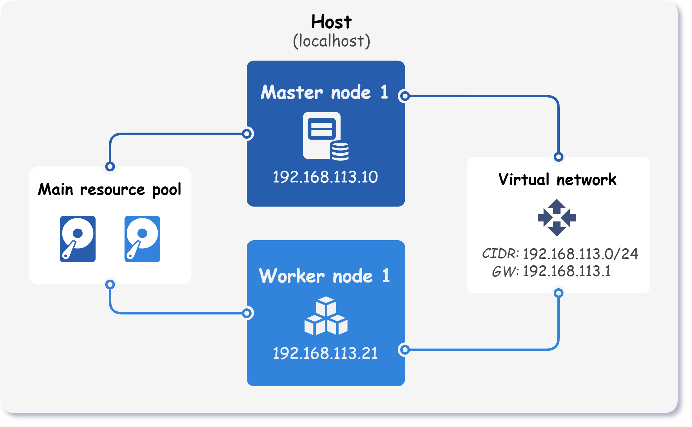

<div markdown="1" class="text-center">
# Getting Started
</div>

<div markdown="1" class="text-justify">

In the [quick start](../quick-start) guide, we learned how to create a Kubernetes cluster using a preset configuration. 
Now, we will explore how to create a customized cluster topology that meets your specific requirements.

This **step-by-step** guide will walk you through the process of creating a custom cluster configuration file from scratch and using it to create a functional Kubernetes **cluster with one master and one worker node**. By following the steps outlined in this guide, you will have a Kubernetes cluster up and running in no time.

<div class="text-center">
  
</div>

## Step 1 - Ensure all requirements are met

Before progressing with this guide, take a minute to **ensure that all of the [requirements](../requirements) are met**.
Afterwards, simply create a new YAML file and open it in a text editor of your choice.

## Step 2 - Prepare hosts configuration

In the cluster configuration file, the first step is to **define hosts**. 
Hosts represent target servers that can be either local or remote machines.

=== "Localhost"

    !!! quote ""

        When setting up the cluster on your local host, where the command line tool is installed, be sure to specify a host with a connection type set to `local`.

        ```yaml title="kubitect.yaml"
        hosts:
          - name: localhost # (1)!
            connection:
              type: local
        ```

        1. Custom **unique** name of the host.

=== "Remote host"

    !!! quote ""

        In case the cluster is deployed on a remote host, you will be required to provide the IP address of the remote machine along with the SSH credentials.

        ```yaml title="kubitect.yaml"
        hosts:
          - name: my-remote-host
            connection:
              type: remote
              user: myuser
              ip: 10.10.40.143 # (1)!
              ssh:
                keyfile: "~/.ssh/id_rsa_server1" # (2)!
        ```

        1. IP address of the remote host.

        2. Path to the **password-less** SSH key file required for establishing connection with the remote host. 

Throughout this guide, only localhost will be used.

## Step 3 - Define cluster infrastructure

The second part of the configuration file consists of the cluster infrastructure.
In this part, all cluster nodes are defined along with their properties such as operating system, CPU cores, amount of RAM and so on.

Below is an image that visualizes the components of the final cluster.

<div class="text-center">
  
</div>

Let's shift our attention to the following configuration:

```yaml title="kubitect.yaml"
cluster:
  name: k8s-cluster
  network:
    ...
  nodeTemplate:
    ...
  nodes:
    ...
```

As we can see, the cluster infrastructure section consists of the cluster name and three subsections:

- `cluster.name` 

    The cluster name is used as a prefix for each resource created by Kubitect. 
    It's an essential property that helps identify and manage resources created by Kubitect.

- `cluster.network` 

    The network subsection holds information about the network properties of the cluster. 
    It defines the IP address range, the mode of networking, and other network-specific properties that apply to the entire cluster.


- `cluster.nodeTemplate` 

    The node template subsection contains properties that apply to all nodes in the cluster, such as the operating system, SSH user, and SSH private key.

- `cluster.nodes` 

    The nodes subsection defines each node in our cluster. 
    This subsection includes information such as the node name, node type, and other node-specific properties.

Now that we have a general idea of the cluster infrastructure configuration, let's examine each of these subsections in more detail to understand how to define them properly and configure a Kubernetes cluster using Kubitect.

### Step 3.1 - Cluster network

In the network subsection of the Kubernetes configuration file, we need to **define the network** that our cluster will use. 
Currently, there are two supported network modes - NAT or bridge.

The `nat` network mode creates a virtual network that performs network address translation.
This mode allows the use of IP address ranges that do not exist within our local area network (LAN).

On the other hand, the `bridge` network mode uses a predefined bridge interface, allowing virtual machines to connect directly to the LAN. 
This mode is mandatory when the cluster spreads over multiple hosts.

For the sake of simplicity, this tutorial will use the NAT mode as it does not require a preconfigured bridge interface."

```yaml title="kubitect.yaml"
cluster:
  ...
  network:
    mode: nat
    cidr: 192.168.113.0/24
```

The above configuration will instruct Kubitect to create a virtual network that uses `192.168.113.0/24` IP range.

### Step 3.2 - Node template

The `nodeTemplate` subsection allows you to **define general properties for all nodes in the cluster**.
While there are no required fields, there are several useful properties you may want to include.

+ `user` 

    This property specifies the name of the user that will be created on all virtual machines and used for SSH. (default: `k8s`) 

+ `os.distro` 

    This property defines the operating system for the nodes. Currently, only Ubuntu and Debian are supported, and by default, the latest Ubuntu 22.04 release is used.

+ `ssh.addToKnownHosts`

    When this property is set to true, all nodes will be added to SSH known hosts. 
    If you later destroy the cluster, these nodes will also be removed from the known hosts.

+ `updateOnBoot`

    This property determines whether virtual machines are updated at first boot

To illustrate, let's set these `nodeTemplate` properties in our configuration file:

```yaml title="kubitect.yaml"
cluster:
  ...
  nodeTemplate:
    user: k8s
    updateOnBoot: true
    ssh:
      addToKnownHosts: true
    os:
      distro: ubuntu22
```

### Step 3.3 - Cluster nodes

In the `nodes` subsection, we **define all nodes that will form the cluster**.
Each node can be defined as one of the following three types:

- `worker` 

    A worker node runs the applications and workloads that are deployed in the cluster. 
    It communicates with the master node to receive instructions on how to schedule and run the containers. 

- `master` 
    
    Master nodes are responsible for managing and coordinating the worker nodes in the cluster.
    Therefore, **each cluster must contain at least one master node**. 

    Since etcd key-value datastore is also present on these nodes, the number of master nodes must be odd. 
    For more information, see [etcd FAQ :octicons-link-external-16:](https://etcd.io/docs/v3.4/faq/#why-an-odd-number-of-cluster-members).

- `loadBalancer` 

    These nodes server as internal load balancers that expose the Kubernetes control plane at a single endpoint.
    They are essential when more then one master node is configured in the cluster.

This guide is focused on deploying a Kubernetes cluster with only one master node, which eliminates the need for internal load balancers. 
However, if you are interested in creating a [multi-master](../../examples/multi-master-cluster) or [high-availability (HA)](../../examples/ha-cluster) cluster, please refer to the corresponding examples.

To better understand this part, let's take a look at an example configuration:

```yaml title="kubitect.yaml"
cluster:
  ...
  nodes:
    master:
      default: # (1)!
        ram: 4 # (2)!
        cpu: 2 # (3)!
        mainDiskSize: 32 # (4)!
      instances: # (5)!
        - id: 1 # (6)!
          ip: 192.168.113.10 # (7)!
    worker:
      default: 
        ram: 8
        cpu: 2
        mainDiskSize: 32
      instances:
        - id: 1
          ip: 192.168.113.21
          ram: 4 # (8)!
```

1.  Default properties are applied to all nodes of the same type, which in this case are the master nodes.
    They are particularly useful to quickly configure multiple nodes of the same type.

2.  The amount of RAM allocated to the master nodes (in GiB).

3.  The number of virtual CPUs assigned to each master node.

4.  The size of the virtual disk attached to each master node (in GiB).

5.  A list of master node instances.

6.  The instance ID is the **only required field** that must be specified for each instance.

7.  A static IP address set for this particular instance.
    If the `ip` property is omitted, the node requests a DHCP lease during creation.

8.  In this example, the amount of RAM allocated to the worker node instance is set to 4 GiB, which overwrites the default value of 8 GiB.

### Step 3.4 - Kubernetes properties

The final section of the cluster configuration contains the Kubernetes properties, 
such as the version and network plugin.


```yaml title="kubitect.yaml"
kubernetes:
  version: v1.24.7
  networkPlugin: calico
```

## Step 4 - Create the cluster

Below is the final configuration for our Kubernetes cluster:

??? abstract "Final cluster configuration <i class="click-tip"></i>"

    ```yaml title="kubitect.yaml"
    hosts:
      - name: localhost
        connection:
          type: local

    cluster:
      name: k8s-cluster
      network:
        mode: nat
        cidr: 192.168.113.0/24
      nodeTemplate:
        user: k8s
        updateOnBoot: true
        ssh:
          addToKnownHosts: true
        os:
          distro: ubuntu22
      nodes:
        master:
          default:
            ram: 4
            cpu: 2
            mainDiskSize: 32
          instances:
            - id: 1
              ip: 192.168.113.10
        worker:
          default: 
            ram: 8
            cpu: 2
            mainDiskSize: 32
          instances:
            - id: 1
              ip: 192.168.113.21
              ram: 4

    kubernetes:
      version: v1.24.7
      networkPlugin: calico
    ```

To create the cluster, **apply the configuration** file to Kubitect:
```sh
kubitect apply --config kubitect.yaml
```

!!! tip "Tip"

    If you encounter any issues during the installation process, please refer to the [troubleshooting](../other/troubleshooting) page first.


After applying the configuration file to Kubitect, a directory for the created Kubernetes cluster is generated and stored in Kubitect's home directory. The default location for the home directory is `~/.kubitect` and has the following structure.

```
~/.kubitect
   ├── clusters
   │   ├── k8s-cluster
   │   ├── my-cluster
   │   └── ...
   └── share
       ├── terraform
       └── venv
```

The `clusters` directory contains a subdirectory for each Kubernetes cluster that you have created using Kubitect. 
Each subdirectory is named after the cluster, for example *k8s-cluster*. 
The configuration files for each cluster are stored in these directories.

The `share` directory contains files and directories that are shared between different cluster installations.

All created clusters can be listed at any time using the `list` subcommand.
```sh
kubitect list clusters

# Clusters:
#   - k8s-cluster (active)
#   - my-cluster (active)
```

## Step 5 - Test the cluster

Once you have successfully installed a Kubernetes cluster, the Kubeconfig file can be found in the cluster's directory. 
However, you will most likely want to **export the Kubeconfig** to a separate file:


```sh
kubitect export kubeconfig --cluster k8s-cluster > kubeconfig.yaml
```

This will create a file named `kubeconfig.yaml` in your current directory.
Finally, to confirm that the cluster is ready, you can list its nodes using the `kubectl` command:

```sh
kubectl get nodes --kubeconfig kubeconfig.yaml
```

:clap: Congratulations, you have completed the *getting started* quide.

</div>
